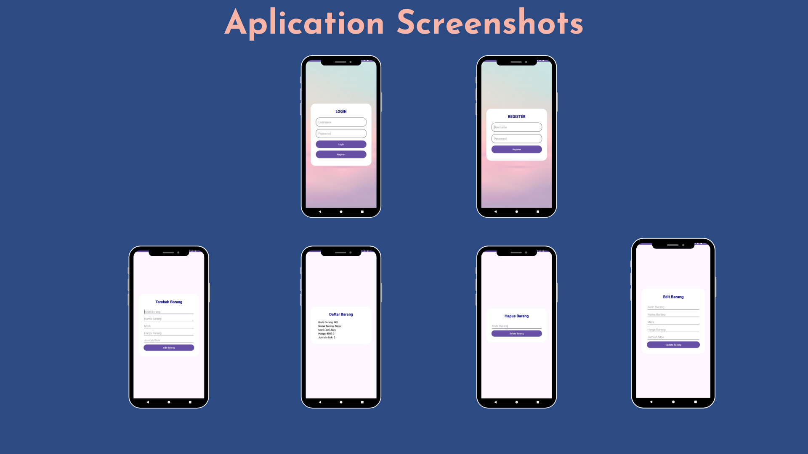

# CRUD Manajemen Barang

Aplikasi Android untuk melakukan CRUD (Create, Read, Update, Delete) pada data barang.

## Fitur Utama

- **Add Barang**: Menambah barang baru ke dalam daftar.
- **View Barang**: Melihat seluruh daftar barang yang ada.
- **Update Barang**: Memperbarui informasi barang yang telah ada.
- **Delete Barang**: Menghapus barang dari daftar.

## Struktur Layout

Aplikasi ini menggunakan `TableLayout` untuk menyusun tombol-tombol utama fungsi CRUD.
  
*Layout Screen*
## Petunjuk Instalasi

1. Clone repository ini ke Android Studio atau unduh ZIP.
2. Pastikan environment Android Studio sudah terpasang dengan benar.
3. Import project dan tunggu hingga semua dependensi terinstall.
4. Hubungkan perangkat Android atau gunakan emulator untuk menjalankan aplikasi.

## Cara Penggunaan

1. **Add Barang**: Klik tombol "Add Barang" untuk membuka form tambah barang.
2. **View Barang**: Klik tombol "View Barang" untuk melihat daftar barang.
3. **Update Barang**: Pilih barang dari daftar, lalu klik "Update Barang" untuk memperbarui informasi barang tersebut.
4. **Delete Barang**: Pilih barang dari daftar, lalu klik "Delete Barang" untuk menghapus barang dari daftar.

